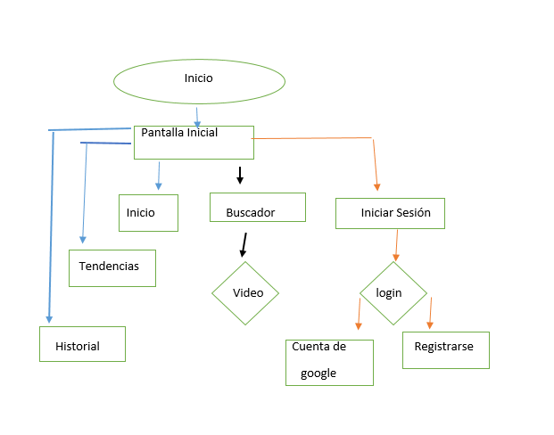

# USER FLOW

# Preambulo

# HISTORIA DE YOUTUBE

# Fundación

**YouTube fue fundada por Chad Hurley, Steve Chen y Jawed Karim el 14 febrero de 2005 en San Bruno, California. Todos ellos se conocieron cuando trabajaban en PayPal, Hurley y Karim como ingenieros, y Chen como diseñador. Hurley y Chen dicen que la idea de Youtube surgió cuando trataron de compartir vídeos tomados durante una fiesta en San Francisco. Esta historia ha sido considerada una versión muy simplificada, que se puede haber promovido por la necesidad de presentar una historia sencilla al mercado.**

**Por su parte Karim ha declarado que la fiesta nunca ocurrió, y que la idea de compartir vídeos en Internet fue suya. Sus compañeros que han declarado que la fiesta sí ocurrió, dicen que la idea original de Karim era crear una página de citas, donde las personas pudiesen calificarse en base a sus vídeos. Karim reconoce haber sido influenciado por un sitio de citas, donde los usuarios podían cargar fotos suyas, que luego eran calificadas por otros usuarios, entonces el interés de Karim sería que los usuarios pudieran cargar también sus videos. (Enseguida las fotos de los creadores)**

# Introducción

__El ejercicio consistia en usar nuestra aplicacion favorita ,en este caso yo elegi Youtube  en plataforma web ya que lo considero una excelente herramienta ya que me permite aprender muchisimas cosas y es fácil de manejar.__

_*Ademas de ya llevar años usandola ,no era muy consiente del flujo que maneja y cuantos cambios ha presentado desde sus inicios.*_

#### fuentes de consulta (https://histinf.blogs.upv.es/2012/12/21/youtube/)
(https://www.youtube.com/watch?v=vtxH-RoHnGM)
